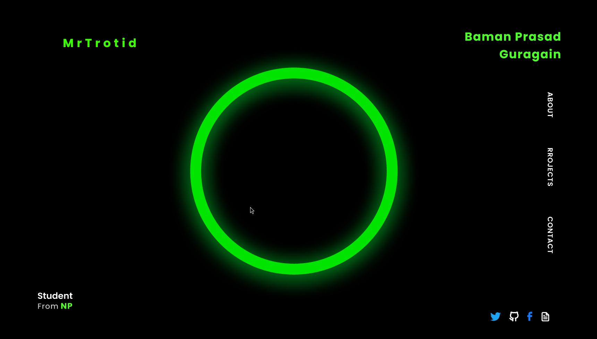

# Mrtrotid Portfolio



A modern, high-performance portfolio website built with Next.js, emphasizing typography, responsive layout, and robust security configurations. Designed with a terminal-inspired, cinematic aesthetic, this portfolio showcases projects, cybersecurity certifications, and professional experience.

## Live Site

- **Production URL:** [https://bamanguragain.com.np](https://bamanguragain.com.np)

## Tech Stack


## Core Features

- **Dedicated Project Case Studies:** Built via the Next.js App Router (`/projects/[slug]`), featuring individual server-rendered (SSG) case studies for enhanced SEO, in-depth context, and independent routing.
- **Interactive Certifications Grid:** A dynamic, filterable grid component built with Framer Motion, displaying an array of professional IT and Cybersecurity certifications (e.g., Cisco, AWS, Programiz).
- **Strict Security Posture:** Enforced via Next.js Middleware (`middleware.ts`). Implements rigid Content Security Policy (CSP) headers, `report-uri`/`report-to` directives, and strict HSTS max-age to prevent XSS and man-in-the-middle attacks.
- **Optimized SEO Architecture:** Robust metadata generation, semantic JSON-LD structures, targeted OpenGraph imagery, and automatic, priority-aware `sitemap.xml` / `robots.txt` generation.
- **Performance & Typography:** Pre-rendered SSG/SSR pages delivering fully populated HTML over the wire. Styled consistently with the retro, terminal-styled `NDot-57` font across the application.
- **Robust CI/CD Pipeline:** GitHub Actions workflow ensuring an unyielding fail-fast sequence (`lint` → `typecheck` → `build` → `unit tests` → `E2E tests`). Protected locally with Husky `pre-push` hooks.

## Project Structure

```text
├── app/
│   ├── layout.tsx         # Root layout with global fonts and SEO
│   ├── page.tsx           # Main landing page assembling UI sections
│   ├── projects/[slug]/   # Dynamic routes for project case studies
│   ├── robots.ts          # Dynamic robots.txt generation
│   └── sitemap.ts         # Dynamic sitemap generation
├── components/
│   ├── cinematic/         # Reusable animated UI elements (Magnetic, HackerType)
│   └── sections/          # Major layout blocks (Hero, Projects, Certifications)
├── lib/
│   ├── motion/            # Shared Framer Motion animation variants
│   ├── profile.ts         # Centralized data source for content (projects, certs)
│   └── site.ts            # Site configuration variables
├── public/                # Static assets, fonts, logos, and images
└── middleware.ts          # Centralized Next.js middleware for security headers
```

## Setup & Local Development

1. **Install Dependencies:**
   ```bash
   npm install
   ```

2. **Run the Development Server:**
   ```bash
   npm run dev
   ```
   *The application will start on `http://localhost:3000`.*

3. **Code Quality Checks:**
   Before pushing, ensure all checks pass (these are also enforced via `.husky/pre-push` and GitHub Actions):
   ```bash
   npm run lint        # Run ESLint
   npm run typecheck   # Run TypeScript Compiler checks
   npm run test        # Run Unit tests
   npm run test:e2e    # Run E2E tests
   ```

## Design Notes

This project emphasizes terminal-styled realism without sacrificing accessibility. The `NDot-57` font heavily influences the uppercase/lowercase design language inherently, offering a distinct retro aesthetic.
