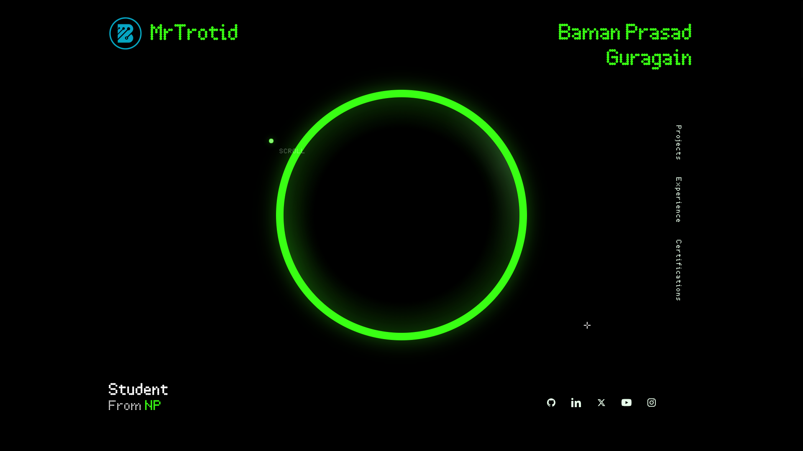
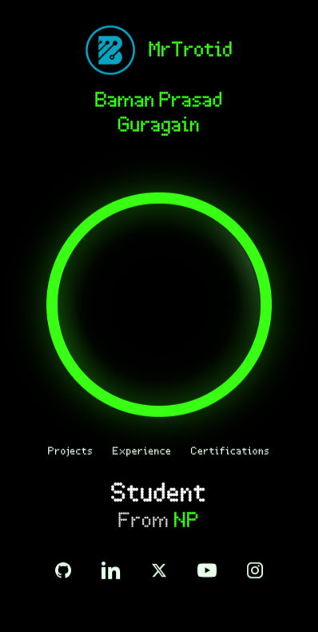
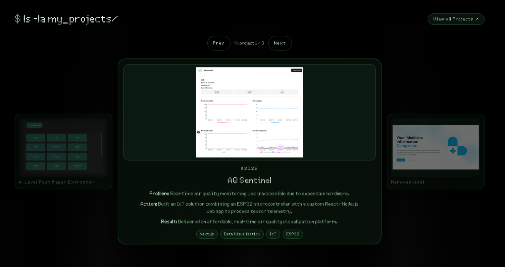
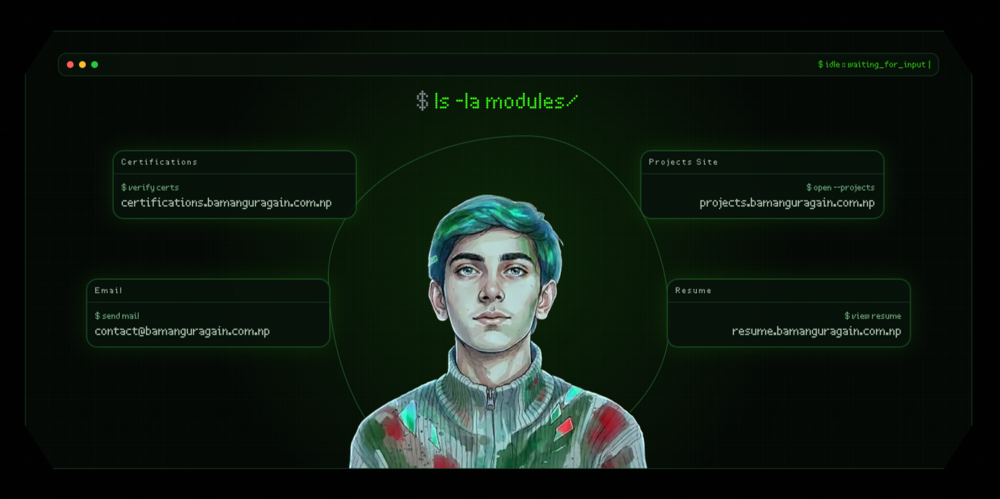

# MrTrotid Portfolio

Personal portfolio of Baman Prasad Guragain — terminal-styled, static-first, built with Next.js. Content for every section lives in one file (`lib/profile.ts`), so updating the site means editing data, not components.

**Live:** [bamanguragain.com.np](https://www.bamanguragain.com.np) · [projects](https://projects.bamanguragain.com.np) · [certifications](https://certifications.bamanguragain.com.np) · [resume](https://resume.bamanguragain.com.np)

## Landing





Single viewport hero: logo, name, centered section links, and socials. The ring behind it is fully static CSS — an earlier animated version caused visible flicker, so nothing on it moves. Below lg the side nav is replaced by one centered horizontal row; on phones the header stacks centered instead of clipping the name off-screen.

## Projects



Featured projects in a carousel (prev/current/next with side previews on desktop). Each card states the problem, action, and result. Clicking a card opens the full write-up on the projects subdomain.

## Contact terminal



A terminal window with a status line, portrait, and four executable modules (certifications, projects site, email, resume). Long domain names auto-shrink to stay on one line at a uniform size across all modules — measured live with `ResizeObserver`, floored at 10px.

## Stack


## Performance notes

Concrete things this repo does, not slogans:

- `/` is prerendered static HTML (no `revalidate` opt-out, no data fetching).
- GSAP ScrollTrigger setup is deferred to `requestIdleCallback` and skipped under reduced motion; blur-based scroll tweens were replaced with opacity/transform-only ones.
- One smooth-scroll system: anchor clicks route through the active Lenis instance instead of fighting it with native `scrollIntoView`.
- `optimizePackageImports` for `framer-motion` / `gsap` / `lenis`; AVIF+WebP with long cache TTL.
- Custom cursor, magnetic hover, and the global text-scramble pass are all gated behind fine-pointer / no-reduced-motion checks; scramble-on-scroll was removed in favor of per-heading `HackerType` that animates once.
- Card `backdrop-filter` blur is disabled below 768px.
- Dead code was deleted, not commented out: unused `SiteNav`, the `cn` util with its `clsx`/`tailwind-merge` deps.

## Security & SEO

- Strict headers via `proxy.ts`: CSP tuned for static Next.js output, HSTS, XSS protection, `poweredByHeader` off.
- Metadata with canonical URL and www redirect, JSON-LD person/website structured data, OpenGraph image (1200×630), generated `sitemap.xml` / `robots.txt` / manifest.

## Project structure

```text
├── app/
│   ├── layout.tsx         # Fonts, metadata, viewport, global effects
│   ├── page.tsx           # Assembles all sections
│   ├── robots.ts          # Dynamic robots.txt
│   └── sitemap.ts         # Dynamic sitemap
├── components/
│   ├── cinematic/         # Cursor, scramble text, magnetic, motion layer, smooth scroll
│   └── sections/          # Hero, about, skills, projects, experience, certs, contact, footer
├── lib/
│   ├── motion/            # Shared animation variants (transform/opacity only)
│   ├── profile.ts         # All site content
│   ├── scroll.ts          # Lenis-aware anchor scrolling
│   └── site.ts            # Canonical site URL
├── public/                # Fonts, logos, portraits, project images, resumes
└── proxy.ts               # Security headers
```

## Setup

Requires Node.js 20.9+ (22 LTS recommended).

```bash
npm install
npm run dev      # http://localhost:3000
```

Before pushing (also enforced by the `pre-push` hook and CI — `lint` → `typecheck` → `build` → `unit` → `e2e`):

```bash
npm run lint
npm run typecheck
npm run test
npm run test:e2e
```

## Content model

`whoami`, `what_i_do`, skills, projects, experience, certifications, leadership, and achievements all render from `lib/profile.ts`. Skills are grouped as Languages / Security / Tools & Systems, matching the resume. Tests in `tests/unit/profile.test.ts` pin the identity fields and featured project names.
